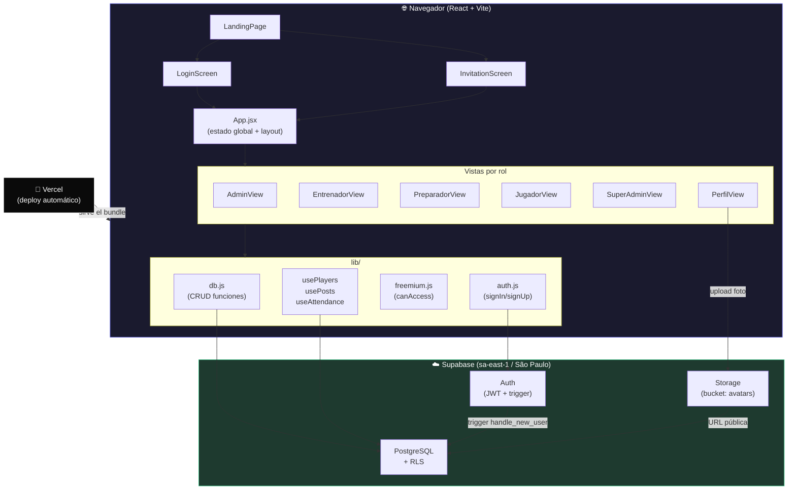
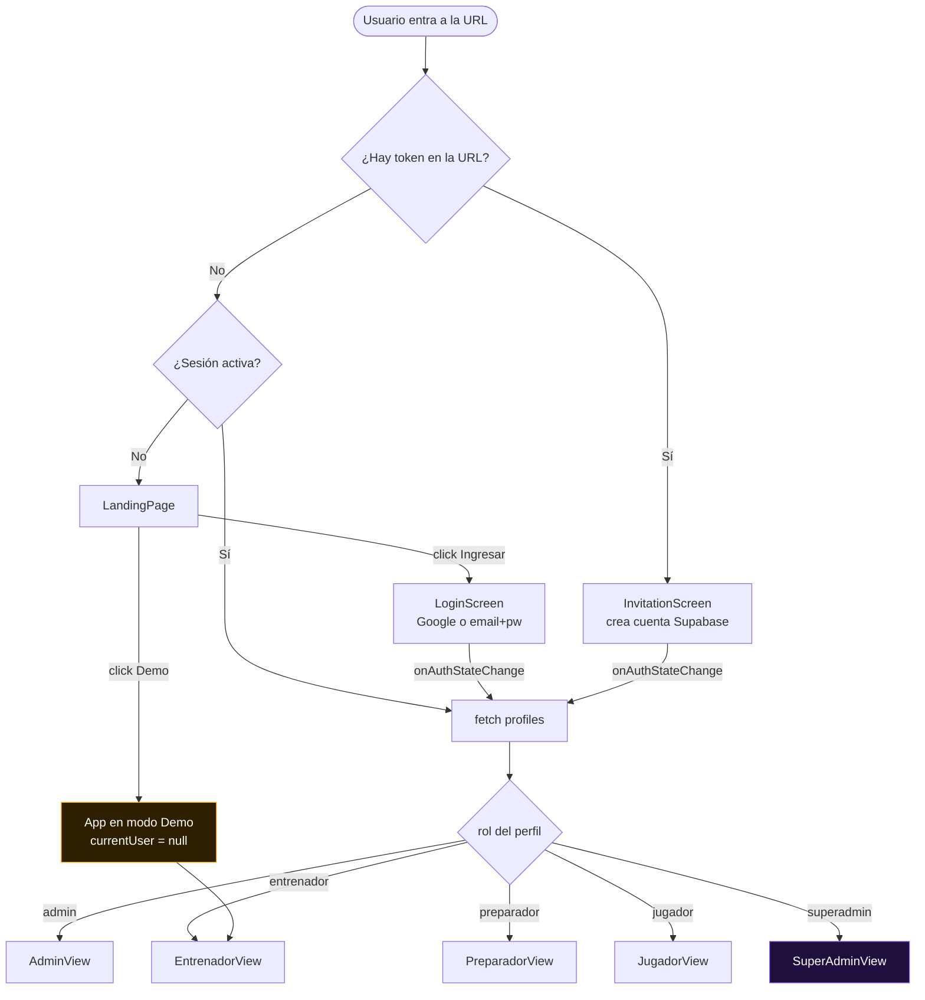
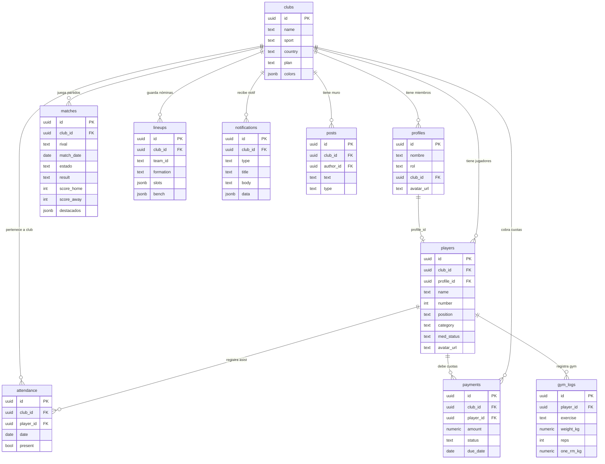
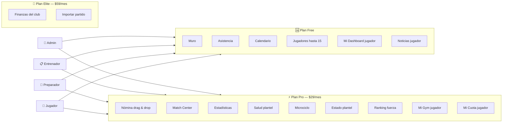

# SportOS — Arquitectura de la Aplicación

> Documento para onboarding técnico. Estado: junio 2026.

---

## Diagrama 1 — Arquitectura del sistema



---

## Diagrama 2 — Flujo de pantallas y autenticación



---

## Diagrama 3 — Esquema de base de datos (ERD)



---

## Diagrama 4 — Módulos por rol y plan requerido



---

## Stack

| Capa | Tecnología |
|---|---|
| Frontend | React 18 + Vite (JavaScript, no TypeScript) |
| Animaciones | Framer Motion |
| Backend / BD | Supabase (PostgreSQL + Auth + Storage + RLS) |
| Deploy | Vercel (CI/CD automático desde `main`) |
| Repo | GitHub — `jmsanchez-kifit/sportsos` |

No hay backend propio. Todo es Supabase directo desde el cliente.

---

## Estructura de carpetas

```
src/
├── App.jsx              # Raíz: routing de pantallas, estado global, layout
├── main.jsx             # Entry point React
│
├── views/               # Una por pantalla/rol
│   ├── LandingPage.jsx
│   ├── LoginScreen.jsx
│   ├── ClubOnboarding.jsx
│   ├── InvitationScreen.jsx
│   ├── OnboardingScreen.jsx
│   ├── HomeView.jsx          # Dashboard home (todos los roles)
│   ├── AdminView.jsx         # Rol admin
│   ├── EntrenadorView.jsx    # Rol entrenador (más grande ~940 líneas)
│   ├── PreparadorView.jsx    # Rol preparador físico
│   ├── JugadorView.jsx       # Rol jugador
│   ├── SuperAdminView.jsx    # Superadmin (jmsanchez@kifit.cl)
│   ├── PerfilView.jsx        # Perfil de usuario (todos los roles)
│   └── NewPasswordScreen.jsx
│
├── components/          # Componentes reutilizables
│   ├── Cancha.jsx        # Visualización de cancha con jugadores
│   ├── Token.jsx         # Círculo de jugador en la cancha (foto o número)
│   ├── Toast.jsx         # Notificaciones temporales
│   ├── Badge.jsx
│   ├── Semaforo.jsx      # Estado médico (verde/amarillo/rojo)
│   ├── ProgressBar.jsx
│   ├── GlobalSearch.jsx  # Búsqueda con Cmd+K
│   ├── WhatsAppModal.jsx # Genera mensaje de WhatsApp con nómina
│   ├── UpgradeModal.jsx  # Gate de freemium
│   ├── OnboardingTip.jsx # Tips contextuales por módulo
│   └── AuroraBg.jsx      # Fondo animado (CSS puro)
│
├── lib/                 # Lógica de negocio y acceso a datos
│   ├── supabase.js       # Cliente Supabase inicializado
│   ├── db.js             # Funciones CRUD a Supabase
│   ├── auth.js           # signUp / signIn / getProfile
│   ├── freemium.js       # Planes, features, canAccess()
│   ├── usePlayers.js     # Hook: lista de jugadores del club
│   ├── usePosts.js       # Hook: posts del Muro
│   ├── useAttendance.js  # Hook: asistencia del día
│   ├── useComments.js    # Hook: comentarios de posts
│   └── useAuth.jsx       # Hook de sesión (no usado en main flow)
│
├── data/                # Datos estáticos y mocks
│   ├── sports.js         # SPORTS_CONFIG, FORMATIONS, TEAMS
│   ├── mockData.js       # MOCK_PARTIDOS, MOCK_PAYMENTS, etc.
│   ├── players.js        # PLAYERS_RUGBY (fallback demo)
│   ├── mockUsers.js
│   └── gymPlan.js        # Plan de gym hardcodeado
│
└── styles/
    ├── tokens.js         # Objeto `ss`: estilos inline reutilizables
    ├── motion.js         # Variantes de animación Framer Motion
    └── (index.css está en src/index.css)
```

---

## Base de datos — Tablas Supabase

### `clubs`
```
id, name, sport, country, plan, colors (jsonb), created_at
```
- `plan`: free | pro | elite
- `colors`: `{"primary":"#1B4332","secondary":"#FFD700"}`

### `profiles`
```
id (= auth.users.id), nombre, rol, club_id, avatar_url, created_at
```
- `rol`: superadmin | admin | entrenador | preparador | jugador
- Se crea automáticamente con trigger `handle_new_user()` al registrarse

### `players`
```
id, club_id, name, number, position, category, age,
med_status, hia_reason, cuota_status,
profile_id (→ profiles.id),
avatar_url, created_at
```
- `profile_id`: vincula al jugador con su cuenta de usuario
- `avatar_url`: URL pública en Supabase Storage bucket `avatars`
- `med_status`: verde | amarillo | rojo

### `matches`
```
id, club_id, team_id, rival, match_date, location,
result, score_home, score_away, notes,
hora, estado, equipo, cat, destacados (jsonb), autor,
created_at
```
- `result`: victoria | derrota | empate | pendiente
- `estado`: programado | jugado

### `lineups`
```
id, club_id, team_id, formation, slots (jsonb), bench (jsonb), updated_at
```
- `slots`: array de player IDs por posición (null = vacío)
- `bench`: array de player IDs en el banco

### `attendance`
```
id, club_id, player_id, date, present (boolean), notes
unique (player_id, date)
```

### `notifications`
```
id, club_id, type, title, body, data (jsonb), created_at
```
- `type`: general | nomina | resultado | wellness
- Se crea cuando el entrenador pulsa "Guardar y notificar" en la nómina

### `posts` + `post_likes`
```
posts: id, club_id, author_id, text, type, created_at
post_likes: post_id, user_id (PK compuesta)
```

### `payments`
```
id, club_id, player_id, amount, currency, method, status, due_date, paid_at
```

### `gym_logs`
```
id, player_id, exercise, set_index, weight_kg, reps, rpe,
one_rm_kg (generated), volume_kg (generated), week_start, logged_at
```

---

## Row Level Security (RLS)

Todas las tablas tienen RLS habilitado. Patrón base:

```sql
-- Función auxiliar
create function my_club_id() returns uuid as $$
  select club_id from profiles where id = auth.uid()
$$;

-- Política típica
create policy "club players" on players
  for all using (club_id = my_club_id());
```

- `profiles`: solo el propio usuario puede leer/editar su perfil
- Todo lo demás: solo ves registros de tu club (`club_id = my_club_id()`)
- Excepción: superadmin (`admin@sportostest.com`) ve todo via bypass en el código

---

## Storage

- **Bucket `avatars`**: fotos de perfil
  - Path por usuario: `{user_id}.jpg`
  - Path por admin: `players/{timestamp}.{ext}`

---

## Autenticación y roles

### Flujo de login
```
LandingPage → LoginScreen → supabase.auth.signInWithPassword()
  → onAuthStateChange (App.jsx) → fetch profiles → setCurrentUser → screen="app"
```

### Flujo de invitación
```
URL: /?token=xxx&rol=jugador
  → InvitationScreen → valida token en BD → crea cuenta Supabase
  → trigger crea profiles → setCurrentUser → screen="app"
```

### Roles
| Rol | Acceso |
|---|---|
| `superadmin` | Todo el sistema, ve todos los clubes |
| `admin` | Su club: jugadores, finanzas, configuración |
| `entrenador` | Muro, nómina, asistencia, salud, calendario |
| `preparador` | Microciclo, estado plantel, ranking fuerza |
| `jugador` | Su dashboard, noticias, convocatoria, gym |

El rol se guarda en `profiles.rol` y en el estado React `role` (App.jsx).
Un superadmin puede cambiar de rol desde el selector de la UI para previsualizar.

---

## Estado global (App.jsx)

No hay Redux ni Zustand. Todo en `useState` dentro de `App.jsx`:

```javascript
currentUser    // null = modo demo | { id, nombre, email, rol, club_id, plan }
role           // "entrenador" | "admin" | "jugador" | ...
module         // módulo activo del sidebar
sport          // "rugby" | "futbol" | "handball" | "basketball" | "hockey"
partidos       // array de partidos (carga desde Supabase si hay clubId)
players        // via usePlayers(clubId) — real o mock
```

**Modo demo**: `currentUser === null` → usa mock data, plan = "pro"

**Modo real**: `currentUser.isReal === true` → datos desde Supabase

---

## Sistema freemium

```javascript
// freemium.js
PLANS = { free, pro ($29/mes), elite ($59/mes) }

FEATURE_PLAN = {
  muro:        "free",
  asistencia:  "free",
  nomina:      "pro",
  estadisticas:"pro",
  finanzas:    "elite",
  // ...
}

canAccess(userPlan, featureId) → boolean
```

- El plan del club admin se hereda por todos sus miembros
- En demo se usa `DEMO_PLAN = "pro"` para mostrar todas las features pro

---

## Módulos por rol

```
superadmin:  home | dashboard | clubes | membresias | comisiones | comparativa | vistaroles
admin:       home | miclub | jugadores | finanzas | miperfil
entrenador:  home | muro | calendario | matchcenter | nomina | estadisticas | asistencia | salud | miperfil
preparador:  home | microciclo | estadoplantel | rankingfuerza | miperfil
jugador:     home | midashboard | noticias | micuota | migym | nominasclub | miconvocatoria | miperfil
```

---

## Patrones de código

### Hooks de datos
```javascript
// Patrón: modo demo vs real
const isReal = !!clubId;
if (!isReal) { /* usar mock, retornar */ }
// usar Supabase...
```

### Vistas condicionales por módulo
```javascript
// EntrenadorView.jsx
if (module === "nomina") return <NominaDND ... />;
if (module === "asistencia") return <AsistenciaGrid ... />;
// etc.
```

### Estilos inline con tokens
```javascript
// No hay CSS Modules ni Tailwind
import { ss } from "../styles/tokens";
<div style={ss.card}>...</div>
<button style={{...ss.btn, background: sportColor}}>...</button>
```

### Animaciones
```javascript
import { motion } from "framer-motion";
import { fadeUp } from "../styles/motion";
<motion.div {...fadeUp}>...</motion.div>
```

---

## Funciones principales en db.js

```javascript
// Jugadores
getPlayers(clubId)
addPlayer(player) / updatePlayer(id, changes) / removePlayer(id)

// Nóminas
getLineups(clubId, teamId)   // trae última nómina guardada
saveLineup({ clubId, teamId, formation, slots[], bench[] })

// Partidos
getMatches(clubId)
saveMatch(clubId, partido)
matchToPartido(dbRow)         // mapea DB → objeto app

// Asistencia
// (via useAttendance hook, no funciones de db.js)

// Posts / Muro
// (via usePosts hook)

// Notificaciones
saveNotification({ clubId, type, title, body, data })
getNotifications(clubId, limit)

// Pagos
getPayments(clubId) / savePayment(payment)
```

---

## Qué está conectado a Supabase vs mock

| Feature | Estado |
|---|---|
| Login / Registro | ✅ Real |
| Invitaciones | ✅ Real |
| Jugadores (lista) | ✅ Real (fallback a mock si tabla vacía) |
| Fotos de perfil | ✅ Real (Storage bucket `avatars`) |
| El Muro (posts) | ✅ Real |
| Asistencia | ✅ Real (carga al abrir módulo) |
| Nómina | ✅ Real (carga + guarda al presionar botón) |
| Calendario / Partidos | ✅ Real (carga + guarda) |
| Notificaciones | ✅ Real (tabla `notifications`) |
| Pagos / Cuotas | ⚠️ Mock (tabla existe, UI completa, sin pasarela) |
| Gym logs | ⚠️ Mock (tabla existe, sin hook conectado al UI) |
| Match Center | ⚠️ Mock |
| Stats / Estadísticas | ⚠️ Mock (calculado desde datos mock) |

---

## Deuda técnica conocida

1. **Archivo grande**: `EntrenadorView.jsx` (~950 líneas) — candidato a dividir
2. **Sin TypeScript**: no hay tipos, fácil desincronizar forma del objeto `player`
3. **Estado en App.jsx**: `partidos`, `players` viven en el root, se pasan por props varios niveles
4. **Sin tests**: cero cobertura automatizada
5. **Pasarela de pagos**: UI completa pero sin integración real (Khipu/Webpay planificado)
6. **Gym logs**: tabla en BD, hook existe, pero la UI del preparador usa datos mock
7. **Push web real**: las notificaciones son in-app (tabla BD), no browser push (requeriría Service Worker + FCM)

---

## Variables de entorno

```
VITE_SUPABASE_URL=https://swhqhuomzhxizwfxxyrt.supabase.co
VITE_SUPABASE_ANON_KEY=...
```

Están en `.env` (no en el repo). El proyecto Supabase es `SPORTOS` en región `sa-east-1` (São Paulo).
